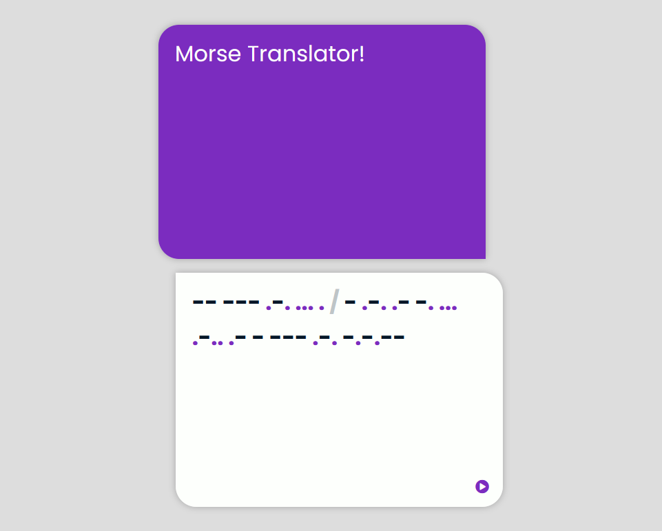
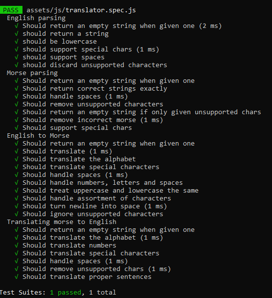

# Morse Translator
A Morse Code to English, or English to Morse Code translator.

Created on Week 5, day 3 of my software development course at _nology, this simple Javascript/HTML translator will receive text input, discern whether it is English or Morse, and translate accordingly. 

The purpose of this project was to create it with test-driven development methodology, where tests are written first and functions are made to pass those tests. It also provided a chance to try integrating Continuous Integration pipelines, running Jest as a Github action every time I push a commit.

## General Info

### Technologies used
* Javascript
* CSS
* SCSS
* HTML
* Jest
* Github Actions

### Design

I wanted this to be as clean and simple as possible - it is simply a text input area and an output area, and thought went in to make it obvious what the user needs to do when presented with this program - as such I chose have large, readable instructions onscreen and also chose to make the output display immediately on typing rather than clicking a button to generate the output. One clickable button in the output field plays the output as audio using either TTS or a series of beeps, depending on whether it is Morse or English.

## How it works

First I had to mock up how the program would work - I decided the simplest route would be to create a `translationKey` object, with the keys being the ASCII characters representing the alphabet and punctuation, and the values being the Morse representation of them. 
I would also need four functions, `parseMorse` and `parseEnglish`, which discard unsupported characters or newlines while formatting the input string in a way that can be easily translated, and  `translateMorseToEnglish` and `translateEnglishToMorse`, which are self explanatory.

### Tests

After blueprinting how the program will work, I wrote a series of unit tests for each function, making sure to be thorough enough to account for any unexpected behaviours.

````javascript
describe("English parsing", () => {
  it("Should return an empty string when given one", () => {
  it("should return a string", () => {
  it("should be lowercase", () => {
  it("should support special chars", () => {
  it("should support spaces", () => {
  it("should discard unsupported characters", () => {

describe("Morse parsing", () => {
  it("Should return an empty string when given one", () => {
  it("Should return correct strings exactly", () => {
  it("Should handle spaces", () => {
  it("Should remove unsupported characters", () => {
  it("Should return an empty string if only given unsupported chars", () => {
  it("Should remove incorrect morse", () => {
  it("Should support special chars", () => {

describe("English to Morse", () => {
  it("Should return an empty string when given one", () => {
  it("Should translate", () => {
  it("Should translate the alphabet", () => {
  it("Should translate special characters", () => {
  it("Should handle spaces", () => {
  it("Should handle numbers, letters and spaces", () => {
  it("Should treat uppercase and lowercase the same", () => {
  it("Should handle assortment of characters", () => {
  it("Should turn newline into space", () => {
  it("Should ignore unsupported characters", () => {

describe("Morse to English", () => {
  it("Should return an empty string when given one", () => {
  it("Should translate the alphabet", () => {
  it("Should translate numbers", () => {
  it("Should translate special characters", () => {
  it("Should handle spaces", () => {
  it("Should remove unsupported chars", () => {
  it("Should translate proper sentences", () => {
````
### Writing the functions

With the tests written (and obviously failing), the functions could follow.

The two parsing functions are incredibly similar. They essentially split the input and throw away any characters that aren't in a key/value pair on the `translationKey` object.

````javascript
export const parseEnglish = (input, translationKey) => {
  let output = [];
  const lowerCaseInput = String(input).toLowerCase();
  lowerCaseInput.split("").forEach((char) => {
    if (Object.keys(translationKey).indexOf(char) != -1) {
      output.push(char);
    }
  });
  return output.join("");
};

export const parseMorse = (input, translationKey) => {
  let output = [];
  input.split(" ").forEach((symbol) => {
    if (Object.values(translationKey).indexOf(symbol) != -1) {
      output.push(symbol);
    }
  });
  return output.join(" ");
};
````

And translating them was as simple as looping through those strings and replacing the keys with the values, and vice versa.

````javascript
export const translateMorseToEnglish = (input, translationKey) => {
  const processedInput = parseMorse(input, translationKey);
  const englishOutput = processedInput.split(" ").map((symbol) => {
    return Object.keys(translationKey).find(
      (letter) => translationKey[letter] === symbol
    );
  });
  return englishOutput.join("");
};

export const translateEnglishToMorse = (input, translationKey) => {
  const processedInput = parseEnglish(input, translationKey);
  const morseOutput = processedInput.split("").map((char) => {
    return translationKey[char];
  });
  return morseOutput.join(" ");
};
````
Boom!



I really like using test-driven methodology, as thinking about all the things that could go wrong with your functions at first and then writing the program with that in mind feels like a much more solid approach to programming than what I was doing before, which was essentially trial and error.

## DOM Interaction

My `scripts.js` file is incredibly simple with this project, totalling at a whopping 45 lines!

The input box has a `keyup` event listener and uses regex to determine whether the user is inputting text or morse.

Depending on which one, the output box runs the associated translator function and prints it in the `innerText`

````javascript
inputArea.addEventListener("keyup", (event) => {
  let textToTranslate = event.target.value;
  if (/^[.\/ -]*$/gm.test(textToTranslate)) {
    outputArea.innerText = translateMorseToEnglish(
      textToTranslate,
      translationKey
    );
  } else {
    outputArea.innerHTML = formatOutput(
      translateEnglishToMorse(textToTranslate, translationKey)
    );
  }
});
````

And to handle the audio output, a `click` event is added to the button which uses the same regex to determine what is in the output box and either uses text-to-speech or plays back the morse in a series of 'dit' and 'dahs' I whipped up in Ableton.

````javascript
audioButton.addEventListener("click", () => {
  if (/^[.\/ -]*$/gm.test(outputArea.innerText)) {
    const soundsToPlay = outputArea.innerText.split("");
    let index = 0;
    setInterval(() => {
      if (soundsToPlay[index] === ".") {
        new Audio("./assets/audio/dit.wav").play();
      }

      if (soundsToPlay[index] === "-") {
        new Audio("./assets/audio/dah.wav").play();
      }
      index++;
    }, 200);
  } else {
    window.speechSynthesis.speak(
      new SpeechSynthesisUtterance(outputArea.innerText)
    );
  }
});
````

## Roadmap

If given more than a day I'd like to -

* Create a mobile app
* Translate to/from other cyphers
